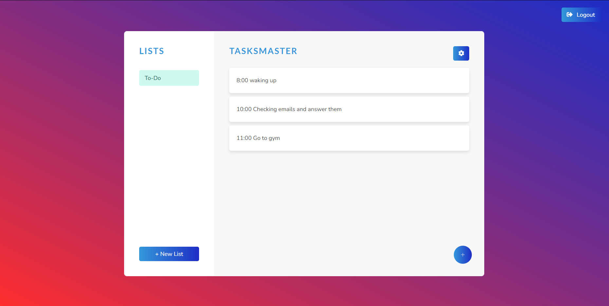

# TaskMaster

TaskMaster is a task management application designed to help users stay organized by creating, categorizing, prioritizing, and tracking tasks efficiently.



## Table of Contents

- [Installation](#installation)
- [Usage](#usage)

## Installation

1. **Clone the Repository:**
   ```bash
   https://github.com/ayoubwe/TaskMaster-portfolio.git
   ```

2.Install Frontend Dependencies:
   ```bash
   cd ../TaskMasterfront
   npm install
   ```
3.Start MongoDB Server:
   Ensure MongoDB is running on your local machine

4.Run Backend Server:
   ```bash
   cd ../api
   npm install
   node app.js
   ```

5.Run Server
   ```bash
   cd ../TaskMasterfront
   ng serve
   ```

## Usage
   - Open your browser and go to http://localhost:4200
   - Register or log in to start managing your tasks


   

   
